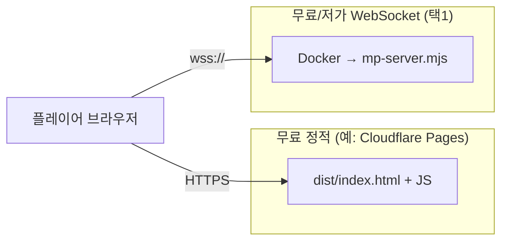

# 무료 티어 설계 (Fly Pieter와 같은 패턴)

## 처음부터 끝까지 — 인터넷에서 멀티플레이 (Render + Cloudflare Pages)

**목표**: 집 밖 친구도 접속 가능하게 **게임 웹페이지(Pages)** + **중계 서버(Render)** 를 연결한다.  
**전제**: 이 프로젝트 폴더가 있고, PC에 **Node.js**가 깔려 있음 (`node -v` 로 확인).

---

### 0단계 — 계정 준비

1. **GitHub** 계정 ([github.com](https://github.com))  
2. **Render** 계정 ([render.com](https://render.com)) — GitHub로 가입 연동 추천  
3. **Cloudflare** 계정 ([cloudflare.com](https://cloudflare.com)) — Pages 쓰려면 필요  

---

### 1단계 — 코드를 GitHub에 올리기 (아직 안 올렸다면)

1. GitHub에서 **New repository** 로 빈 저장소 하나 만든다 (이름 예: `gun_fight`).  
2. 로컬 프로젝트 폴더에서 (한 번만):

   ```powershell
   cd e:\2026games\gun_fight
   git init
   git add .
   git commit -m "initial"
   git branch -M main
   git remote add origin https://github.com/본인아이디/gun_fight.git
   git push -u origin main
   ```

   (저장소 URL은 본인 것으로 바꾼다. `.git` 이 이미 있으면 `git init` 은 하지 말고 `remote`/`push` 만 맞춘다.)

3. GitHub 웹에서 저장소를 열었을 때 **루트에** `Dockerfile`, `render.yaml`, `server` 폴더, `public` 폴더가 보이면 된다.

---

### 2단계 — Render에 중계 서버(`mp-server`) 올리기

1. [dashboard.render.com](https://dashboard.render.com) 로그인.  
2. **New +** → **Blueprint**.  
3. **Connect repository** → 방금 올린 **GitHub 저장소** 선택. (처음이면 GitHub 앱 권한 허용.)  
4. **Branch**: `main` (또는 쓰는 브랜치).  
5. Render가 **`render.yaml`** 을 읽는다. **Apply** / **Create Blueprint** 로 배포 시작.  
6. **Logs** 를 열어 빌드가 **성공(Success / Live)** 할 때까지 기다린다. (처음엔 **5~15분**도 걸릴 수 있음.)  
7. 같은 화면 또는 **Dashboard → Web Services → `gun-fight-ws`**(이름은 yaml 기준) 를 눌러 **URL** 을 복사한다.  
   예: `https://gun-fight-ws.onrender.com`

---

### 3단계 — 중계 서버가 살아 있는지 확인

1. 브라우저 주소창에 아래만 넣는다 (본인 URL로 바꿈):

   `https://gun-fight-ws.onrender.com/health`

2. 화면에 **`gun-fight-mp ok`** 가 보이면 **정상**.  
3. 멀티 접속용 주소는 **`https`가 아니라 `wss://`** 이다:

   `wss://gun-fight-ws.onrender.com`

   (호스트만 같고, 앞만 `wss://`, **뒤에 `:443` 이나 경로 붙이지 않음**.)

---

### 4단계 — 게임이 그 주소를 쓰게 하기

1. PC에서 프로젝트 열기: **`public/mp-ws-config.json`**  
2. 내용을 이렇게 바꾼다 (호스트는 **3단계 본인 것**):

   ```json
   {
     "mpWsUrl": "wss://gun-fight-ws.onrender.com"
   }
   ```

3. 저장한다.

---

### 5단계 — 웹게임 파일 빌드하기

프로젝트 폴더에서 **한 번에** (의존성 설치 + Vite 빌드):

```powershell
cd e:\2026games\gun_fight
npm run pages:build
```

(`package.json` 의 `pages:build` = `npm install` 후 `npm run build` 자동 실행.)

수동으로 나누려면 예전처럼 `npm install` → `npm run build` 도 동일하다.

#### `npm` / `node` 가 인식되지 않을 때 (Windows)

PowerShell에 **`npm: The term 'npm' is not recognized`** 가 나오면 **Node.js가 없거나 PATH에 안 잡힌 것**이다.

1. **[nodejs.org](https://nodejs.org)** 에서 **LTS** 설치 프로그램 받아 실행한다.  
2. 설치 마법사에서 **“Add to PATH”** / PATH 관련 옵션이 있으면 **켜 둔다.**  
3. **Cursor·PowerShell·터미널 창을 전부 닫았다가** 다시 연다. (이전 세션은 옛 PATH를 쓴다.)  
4. 새 창에서 확인:
   ```powershell
   node -v
   npm -v
   ```
5. **nvm-windows** 를 쓰는 경우: 관리자 PowerShell에서 `nvm list` 후 `nvm use 버전` 한 번 실행한 뒤, 같은 창에서 `npm run pages:build` 한다.  
6. 그래도 안 되면: Windows **설정 → 시스템 → 정보 → 고급 시스템 설정 → 환경 변수** → 사용자 또는 시스템 **Path** 에  
   `C:\Program Files\nodejs` 가 있는지 보고, 없으면 **추가**한다.

끝나면 폴더 **`dist`** 가 생긴다. 구조 예시:

```text
dist/
  index.html
  mp-ws-config.json    ← public 과 같은 이름, dist 루트 (assets 안이 아님)
  assets/
    index-xxxxx.js
    …
```

**`mp-ws-config.json` 은 `dist/assets/` 가 아니라 `dist/` 바로 아래**에 있다. 탐색기에서 `dist` 를 열었을 때 `index.html` 옆에 있어야 한다. (빌드는 `vite.config.js` 에서 한 번 더 복사해 두어 누락을 막는다.)

---

### 6단계 — Cloudflare Pages에 `dist` 올리기

**방법 A — Git 연동 (추천, 이후 수정 편함)**

1. **4단계** 내용을 포함해 `mp-ws-config.json` 변경을 **Git에 커밋·푸시**한다.  
2. [Cloudflare Dashboard](https://dash.cloudflare.com) → **Workers & Pages** → **Create** → **Pages** → **Connect to Git**.  
3. 같은 **GitHub 저장소** 연결.  
4. 빌드 설정:
   - **Framework preset**: None 또는 Vite  
   - **Build command**: **`npm run build`** 권장. (`npm install` 은 Cloudflare가 먼저 함.)  
     - **`npm run pages:deploy` 는 쓰지 마세요.** — 안에서 `wrangler pages deploy` 가 돌아가며 Git Pages 빌드와 맞지 않고 실패하기 쉽습니다.  
   - **Build output directory**: `dist`  
   - **중요**: 저장소 **루트에 `wrangler.toml` 을 두지 마세요.** Workers 배포로 오인되어 `main = src/index.ts` / `wrangler deploy` 오류가 날 수 있습니다. 로컬 CLI용 예시는 `wrangler.pages.local.example.toml` 만 참고합니다.  
5. **Save and Deploy**. 완료 후 나오는 **`https://xxxx.pages.dev`** 가 **게임 주소**다.

**방법 B — `dist`만 직접 업로드**

1. Pages에서 **Direct Upload** 로 **`dist` 폴더 안의 파일들**만 올린다 (`node_modules` 전체는 안 됨).  
2. 또는 로컬에서 Wrangler 사용 시: `npm run build` 후 `npm run pages:deploy` (토큰·프로젝트명 설정 필요, `package.json` 참고).

---

### 7단계 — 혼자 테스트

1. 브라우저에서 **Cloudflare Pages URL** (`https://….pages.dev`) 연다.  
2. 메뉴에서 **「오픈월드 MMO 입장」** (또는 **온라인 깃발**) 클릭.  
3. 연결이 안 되면 **F12 → Console / Network** 에서 WebSocket 오류를 본다.  
   - `mpWsUrl` 오타, `wss` 아님, Render 슬립(첫 접속 대기) 등을 의심한다.

---

### 8단계 — 친구와 멀티

1. 친구에게 **같은 Pages URL** 을 보낸다.  
2. 둘 다 **같은 모드**(예: MMO)로 들어가고, **방 ID**를 맞춘다. 메뉴 **「연결 설정」** 에서 기본 **`public`** 이면 둘 다 `public` 으로 두면 같은 방이다.  
3. Render **무료 플랜**은 가끔 **슬립** → 첫 접속이 느릴 수 있다.

---

### 정리 체크리스트

| 순서 | 할 일 | 완료 표시 |
|------|--------|-----------|
| 1 | GitHub에 코드 푸시 | ☐ |
| 2 | Render Blueprint 배포 → Live | ☐ |
| 3 | `/health` → `gun-fight-mp ok` | ☐ |
| 4 | `mp-ws-config.json` → `wss://…onrender.com` | ☐ |
| 5 | `npm run build` | ☐ |
| 6 | Cloudflare Pages에 배포 | ☐ |
| 7 | MMO 입장 테스트 | ☐ |

---

## PaaS 빠른 시작 — 릴레이만 돈 안 내고 올리기

아래는 **Node/Docker 프로세스가 PaaS에서 돌아가게** 하는 최소 루트입니다. (프론트 Pages는 그 다음 단계.)

### 배포 끝나면 공통으로 할 일

1. PaaS가 준 **호스트**를 확인한다 (예: `something.fly.dev`, `xxx.onrender.com`).  
2. 게임에 넣을 주소는 **`wss://호스트`** (포트 없음, `https://` 가 아님).  
3. **`public/mp-ws-config.json`** → `"mpWsUrl": "wss://..."` 저장 후 `npm run build` → Cloudflare Pages에 `dist` 배포.  
4. 브라우저에서 **`https://호스트/health`** 열어 **`gun-fight-mp ok`** 가 나오면 HTTP·프로세스 정상.

---

## Fly.io 없이 멀티플레이 — 무료에 가까운 대안

지금 게임은 **WebSocket 릴레이(`mp-server`) 주소만 `wss://…` 로 맞추면** 되므로, **Fly가 아니어도 됩니다.**  
아래는 **이 레포의 `Dockerfile` / `server/mp-server.mjs` 를 그대로** 쓰는 쪽만 적었습니다 (코드 거의 안 고침).

| 추천 순서 | 방식 | 특징 |
|-----------|------|------|
| **1** | **Render.com** (아래 절) | **웹만**으로 배포. **New → Blueprint** → GitHub 연결. **PC에 CLI 불필요.** 무료 플랜은 **슬립** 있음. |
| **2** | **Railway** (아래 절) | GitHub 연결 + **Dockerfile** 자동 빌드. 대시보드에서 도메인 발급. 무료는 **크레딧·정책** 자주 변함. |
| **3** | **Oracle Cloud Always Free (ARM VM)** | VM에 Node 또는 Docker로 `mp-server` 실행. **슬립 거의 없음**에 가깝지만 **가입·방화벽·SSH** 공수 큼. (아래 상세 절 참고) |
| **4** | **집 PC + Cloudflare Tunnel** | `npm run mp-server` 로 돌리고 **Tunnel**로 `wss` 노출. **돈 0**, 대신 **PC·인터넷 켜 두기**. |
| **5** | **같은 Wi‑Fi(로컬)** | 한 PC에서 `npm run mp-server`, 다른 기기는 `ws://(그PC의LANIP):8787` 로 접속 테스트. **인터넷 공개 아님.** |

**다른 종류의 “무료 멀티”** (Firebase, PartyKit, Ably 등)는 **지금 `mpBridge` 프로토콜과 다르게** 클라이언트·서버를 **새로 짜는 수준**이라, 이 문서에서는 제외했습니다.

---

### 1) Fly.io (이 레포 기본값: `fly.toml` + 루트 `Dockerfile`)

```bash
# 1회: https://fly.io/docs/hands-on/install-flyctl/
fly auth login
# 프로젝트 루트에서 — 앱 이름이 겹치면 fly.toml 의 app= 를 고유하게 수정
fly launch --no-deploy   # 이미 fly.toml 있으면 설정만 맞춤
fly deploy
```

- 접속 URL: **`wss://<fly.toml의-app이름>.fly.dev`**  
- 로그: `fly logs`  
- **GitHub에서 자동 배포**: 저장소 Secrets에 `FLY_API_TOKEN` 넣고 Actions 탭에서 **Deploy mp-server (Fly.io)** 실행 (또는 `Dockerfile` 등 변경 시 push).

#### Windows에서 flyctl 설치·인증이 안 될 때

1. **PowerShell 7(`pwsh`)로 실행**  
   “Shell 7”을 깔았다면 **시작 메뉴 → PowerShell 7** 또는 터미널 프로필에서 **pwsh** 를 쓴다.  
   **Windows PowerShell 5.1** 만 쓰면 `install.ps1` 이 막히거나 동작이 다른 경우가 많다.

2. **실행 정책 (한 번만, 현재 사용자)**  
   PowerShell 7 창에서:
   ```powershell
   Set-ExecutionPolicy -ExecutionPolicy RemoteSigned -Scope CurrentUser
   ```

3. **공식 설치 스크립트**  
   ```powershell
   iwr https://fly.io/install.ps1 -useb | iex
   ```
   끝나면 **터미널을 닫았다가 다시 연 뒤** `fly version` 입력해 본다.

4. **`fly` 명령을 못 찾는다**  
   설치 로그에 나온 경로(예: 사용자 폴더 아래 `.fly\bin`)가 **PATH**에 들어갔는지 확인한다. 안 들어갔으면 그 폴더를 PATH에 추가하거나, **새 Windows 사용자 세션**으로 다시 로그인한다.

5. **`fly auth login` 이 안 된다**  
   - 방화벽·백신이 `fly.io` 접속을 막는지 확인.  
   - 브라우저 로그인 대신: Fly 대시보드에서 **Deploy tokens / API token** 발급 후  
     `fly auth token` 으로 토큰 붙여 넣기(문서: [Fly API tokens](https://fly.io/docs/security/tokens/)).  
   - **PC에 flyctl 없이** 가려면: GitHub에 이 저장소 올린 뒤 **Secrets → `FLY_API_TOKEN`** 저장하고, Actions에서 **Deploy mp-server (Fly.io)** 만 실행해도 배포는 된다.

6. **그래도 싫으면 Fly 생략**  
   **Render.com → New → Blueprint** 만으로 브라우저에서 릴레이를 올릴 수 있다(위 **2) Render**). PC에 CLI 설치가 필요 없다.

7. **`UntrustedRoot` / 인증서 체인 오류** (`iwr https://fly.io/...` 실패)  
   - **PC 날짜·시간**이 맞는지 확인.  
   - **Windows 업데이트**로 루트 인증서 갱신. 회사망이면 **SSL 검사(프록시)** 로 자체 인증서를 쓰는 경우가 많다 → IT에 **루트 CA 설치** 요청하거나, **집/핫스팟** 같은 다른 네트워크에서 다시 시도.  
   - **스크립트 없이 설치**: 브라우저로 [flyctl Releases](https://github.com/superfly/flyctl/releases) 열기 → **Windows x86_64**용 `.zip` 받기 → 압축 풀고 `flyctl.exe` 를 원하는 폴더(예: `C:\Tools\fly\`)에 두고, 그 경로를 **PATH**에 추가. 터미널을 다시 연 뒤 `flyctl version` 또는 `fly version` 확인(이름은 빌드에 따라 `fly.exe` 일 수 있음).  
   - 인증서 검증을 끄는 설치는 **보안상 비추천**이다. 불가피할 때만 본인 책임으로 PowerShell 7에서만 일시적으로 검토.

---

### 2) Render.com — 처음부터 (Blueprint 권장)

**올라가는 것**: 이 레포 루트의 **`Dockerfile`** 로 빌드된 **`mp-server`** 만 (WebSocket 릴레이). **게임 화면(`dist`)은 Render에 안 올려도 됨** — 그건 Cloudflare Pages 등.

#### 준비

1. **GitHub**에 이 프로젝트가 올라가 있어야 함. 루트에 다음이 있어야 한다.  
   - `Dockerfile`  
   - `render.yaml` (Blueprint용)  
   - `server/mp-server.mjs` 등 (Docker가 복사함)  
2. **브랜치** 이름을 기억해 두기 (보통 `main`).

#### A안) Blueprint로 한 번에 (추천)

1. [dashboard.render.com](https://dashboard.render.com) 접속 → **Sign up** (가입).  
   **GitHub로 연동**해 두면 저장소 선택이 편하다.  
2. 대시보드에서 **New +** → **Blueprint**.  
3. **Connect a repository** → 본인 **GitHub 저장소** 선택 (`gun_fight` 등).  
   처음이면 GitHub에 **Render 앱 권한**을 허용해야 한다.  
4. **Branch** 를 `main`(또는 쓰는 브랜치)으로 맞춘다.  
5. Render가 루트의 **`render.yaml`** 을 읽는다.  
   - 서비스 이름 예: **`gun-fight-ws`**  
   - **Docker** 빌드, **`healthCheckPath: /health`**, **Free** 플랜 등이 자동 적용된다.  
6. **Apply** / **Create Blueprint** (버튼 이름은 화면 기준) 눌러 배포 시작.  
7. **Logs** 탭에서 Docker 빌드·실행 로그를 본다. 첫 배포는 **몇 분** 걸릴 수 있다.  
8. 성공하면 **해당 Web Service** 를 클릭 → 상단에 **`https://gun-fight-ws.onrender.com`** 같은 **URL**이 보인다. (이름은 `render.yaml` 의 `name` 또는 Render에서 바꾼 이름에 따라 다름.)  
9. 브라우저 새 탭에서 **`https://(위주소의호스트만)/health`** 열기 → **`gun-fight-mp ok`** 가 나오면 정상.  
10. 게임에 넣을 주소는 **`https`가 아니라 `wss://`** 이다.  
    예: `https://gun-fight-ws.onrender.com` → **`wss://gun-fight-ws.onrender.com`**  
11. 프로젝트 **`public/mp-ws-config.json`** 수정:
    ```json
    { "mpWsUrl": "wss://gun-fight-ws.onrender.com" }
    ```
    (호스트는 본인 Render URL에 맞게.)  
12. 로컬에서 **`npm run build`** → **`dist`** 를 **Cloudflare Pages** 등에 배포. 플레이어는 Pages URL로 접속.

#### B안) Blueprint 없이 Web Service만 만들기

1. **New +** → **Web Service**.  
2. 저장소 연결 → **Runtime: Docker**.  
3. **Dockerfile Path**: `./Dockerfile` (루트 기준).  
4. **Instance type**: Free 선택 가능하면 Free.  
5. **Advanced** → **Health Check Path**: `/health` (권장).  
6. **Create Web Service**. 이후 단계는 A안의 7~12와 동일.

#### 자주 나는 일

- **빌드 실패**: 로그에 Docker 에러 확인. 로컬에서 `docker build -t test .` 가 되는지 먼저 본다.  
- **502 / 연결 안 됨**: 배포가 아직 안 끝났거나 슬립에서 깨는 중. 잠시 후 다시 시도.  
- **무료 플랜 슬립**: 오래 비면 잠든다 → **첫 접속이 수십 초** 걸릴 수 있음.  
- Render가 **카드 등록**을 요구할 수 있음 — 정책은 [Render 요금/문서](https://render.com/docs) 기준.

---

### 3) Railway

1. [railway.app](https://railway.app) → **New Project** → **Deploy from GitHub** → 이 저장소.  
2. **Dockerfile** 빌드로 잡히는지 확인 (루트 `Dockerfile`).  
3. **Settings → Networking → Generate Domain** → 나온 도메인을 **`wss://`** 로 변환해 넣는다.  
4. `railway.toml` 은 이미 **Dockerfile 경로**를 가리킨다.

---

**브라우저(Three/React) + 정적 호스팅 + 별도 WebSocket 릴레이** 로 나눕니다.  
Pages는 **HTML/JS만** 서빙하고, **멀티플레이**는 **항상 다른 호스트의 Node `mp-server`** 가 담당합니다.



| 역할 | 무엇에 올리나 | 무료 예시 |
|------|----------------|-----------|
| 게임 화면·로직 | **`dist`만** | Cloudflare Pages 무료 |
| MMO/온라인 깃발 릴레이 | **Node WebSocket** | Fly.io / Railway / Render 무료 구간 (슬립·한도 주의) |

**“영원히 100% 무제한 무료”는 없습니다.** 위 조합은 **0원으로 시작**하기 좋은 설계일 뿐, 트래픽이 크면 유료로 넘어갈 수 있습니다.

---

## 무료로 릴레이 서버를 (거의) 계속 돌리기 — 상세

멀티플레이에 필요한 건 **브라우저가 `wss://` 로 붙을 수 있는 프로세스**가 **어딘가에서** 돌아가는 것입니다.  
이 레포의 `mp-server`는 **HTTP + WebSocket** 한 포트에서 동작합니다.

- 브라우저 WebSocket: 그대로  
- **헬스 체크**: `GET https://당신-서버/health` 또는 `/` → `200` + `gun-fight-mp ok` (Render·일부 PaaS가 프로세스 살아 있음을 판단할 때 유리)

### 현실 정리 (무료 플랜)

| 방식 | “계속 켜짐”에 가까운 정도 | 비고 |
|------|---------------------------|------|
| **Fly.io** 무료 할당량 | `min_machines_running = 0` 이면 **유휴 시 꺼짐** → 첫 접속 **수 초~콜드 스타트** | 24시간 무조건 ON은 보통 **유료(머신 1대 유지)** 에 가깝다. |
| **Render** 무료 Web | **일정 시간 요청 없으면 슬립** → 깨어날 때까지 **수십 초** 걸릴 수 있음 | `healthCheckPath: /health` 로 주기적 체크 시 깨어 있는 시간이 늘어날 수 있음(플랜·정책은 Render 쪽 확인). |
| **Railway** | 정책·크레딧은 자주 바뀜 | GitHub 연동 + Dockerfile 로 동일 이미지 배포 가능. |
| **Oracle Cloud Always Free ARM** | VM **한 대 잡아 두면** 사실상 **항상 ON**에 가장 가깝다 | **가입·방화벽·SSH 설정** 공수는 큼. Docker 또는 `node server/mp-server.mjs` 직접 실행. |
| **집 PC + `npm run mp-server`** | PC·전원·인터넷이 켜져 있는 동안만 | **100% 돈 안 씀**. 외부 공개는 **Cloudflare Tunnel** 등으로 `wss` 노출. |

**약관**: “슬립 막으려고 무분별하게 외부 핑만 때리기”는 서비스마다 금지일 수 있음. 공식 헬스 URL·실제 플레이 트래픽이 안전하다.

---

### A) Fly.io — 단계별 (무료로 시작)

1. [fly.io](https://fly.io) 가입, [flyctl 설치](https://fly.io/docs/hands-on/install-flyctl/).  
2. 프로젝트 루트에서:
   ```bash
   fly auth login
   fly launch
   ```
   - 앱 이름은 **전 세계 유일**해야 함. `fly.toml` 의 `app = 'gun-fight-mp'` 가 이미 있으면 **본인 이름으로 변경**.  
   - 리전은 가까운 곳(예: `nrt`, `iad`).  
3. 배포:
   ```bash
   fly deploy
   ```
4. 대시보드 **Apps → 해당 앱 → Hostname** 확인. WebSocket 주소는 **`wss://앱이름.fly.dev`** (포트 없음, 443).  
5. **로그·상태**
   ```bash
   fly logs
   fly status
   ```
6. **콜드 스타트**  
   - `fly.toml` 에 `min_machines_running = 0` 이면 오래 비면 머신이 내려감 → **첫 접속이 느릴 수 있음**.  
   - “항상 깨어 있게” 하려면 Fly 쪽 **유료 스케일**을 봐야 하는 경우가 많다.

---

### B) Render.com — 무료 Web Service + Blueprint

1. [render.com](https://render.com) 가입 → **New → Blueprint** → 이 Git 저장소 연결.  
2. 루트의 `render.yaml` 을 쓰면 Docker 빌드 + **`healthCheckPath: /health`** 가 잡힌다.  
3. 배포 완료 후 **HTTPS URL** 이 나오면, 게임에는 **`wss://서비스이름.onrender.com`** 형태로 넣는다.  
4. **슬립**: 무료는 가끔 잠든다. 첫 접속이 느리면 **정상 동작**일 수 있음.

---

### C) Railway — 요약

1. New Project → **GitHub 저장소** 연결.  
2. **Dockerfile** 이 루트에 있으면 자동으로 빌드하는 경우가 많다.  
3. **Settings → Networking → Generate Domain** → 나온 `https://` 호스트를 **`wss://`** 로 바꿔 `mp-ws-config.json` 에 넣는다.  
4. 무료 크레딧·정책은 [Railway 공지](https://railway.app) 기준으로 확인.

---

### D) Oracle Cloud Always Free (진짜 “오래” 무료에 가까움)

1. Oracle Cloud 가입 → **Always Free** ARM 인스턴스 생성(가이드 많음).  
2. **보안 목록**에서 **TCP 8787**(또는 쓸 포트) 인바운드 허용.  
3. SSH 접속 후 Node 설치 또는 Docker 설치.  
4. 이 레포를 클론하거나 `server/` 만 올려서:
   ```bash
   cd server && npm install && PORT=8787 node mp-server.mjs
   ```
   또는 Docker 이미지 빌드 후 실행.  
5. 퍼블릭 IP + 포트 또는 도메인 앞에 **Nginx + certbot** 으로 TLS를 씌우면 **`wss://`** 가 된다(공수 추가).

---

### E) 집 PC 100% 무료 — `mp-server` + Cloudflare Tunnel

1. PC에서 평소처럼:
   ```bash
   npm run mp-server
   ```
2. [Cloudflare Tunnel (cloudflared)](https://developers.cloudflare.com/cloudflare-one/connections/connect-apps/) 로 **로컬 8787** 을 터널링 → Cloudflare가 준 **HTTPS 도메인**으로 외부 접속.  
3. 브라우저 게임의 `mp-ws-config.json` 에 **`wss://터널-도메인`** 을 넣는다.  
4. **전제**: PC 전원·잠자기 해제·인터넷 유지. 집 IP 바뀌어도 터널만 살아 있으면 URL은 유지되는 경우가 많다.

---

### 배포 후 꼭 할 일 (클라이언트)

1. 릴레이 주소를 **`public/mp-ws-config.json`** 의 `mpWsUrl` 에 **`wss://...`** 로 넣는다.  
2. `npm run build` 후 Pages에 `dist` 배포(또는 Git 자동 빌드).  
3. 브라우저에서 **온라인 MMO** 들어가 보고, 안 되면 **F12 → Network → WS** 에서 연결 실패 원인 확인.

### 살아 있는지 빠르게 확인

- 브라우저에서 `https://당신-릴레이-호스트/health` 열어 **`gun-fight-mp ok`** 가 보이면 HTTP 레이어는 정상.  
- 그 다음 게임에서 **같은 호스트로 `wss://`** 연결.

---

## WebSocket 주소 우선순위 (클라이언트)

1. 빌드 시 **`VITE_MP_WS`** 가 있으면 그걸 쓰고, 런타임 설정 파일은 읽지 않음.  
2. 없으면 **`/mp-ws-config.json`** (`public/mp-ws-config.json` → 빌드 후 `dist` 루트) 의 **`mpWsUrl`** 문자열이 비어 있지 않으면 사용.  
   → Pages에 **JS 다시 빌드 없이** JSON만 고쳐서 재배포할 수 있음.  
3. 둘 다 없으면 **같은 호스트 `:8787`** (로컬 개발용).

## 빠른 순서

1. **먼저** Fly / Railway / Render 중 하나에 **`Dockerfile`로 mp-server 배포** → `wss://...` 주소 확보  
2. **`public/mp-ws-config.json`** 에 `"mpWsUrl": "wss://..."` 입력 (또는 빌드 변수 **`VITE_MP_WS`**)  
3. Cloudflare Pages에 **`npm run build`** 후 `dist` 배포 (Git 연동이면 저장소의 `mp-ws-config.json` 포함)  
4. 플레이어는 **Pages URL**만 열면 멀티가 그 주소로 붙습니다.

### Wrangler로 dist만 던지기 (레포에 맞춰 둠)

1. **WebSocket 서버** 먼저 배포 → `wss://...` 확보  
2. **프론트 빌드 주소 고정**
   - `.env.production.example` 을 복사해 `.env.production` 만들고 `VITE_MP_WS=wss://...` 수정  
   - 또는 PowerShell: `$env:VITE_MP_WS="wss://..."; npm run build`
3. **Cloudflare API 토큰** (Pages 권한) 발급 후:
   - PowerShell: `$env:CLOUDFLARE_API_TOKEN="여기토큰"`
4. **배포** (프로젝트 이름을 바꿨다면 `package.json` 의 `pages:deploy` 안 `--project-name` 도 같이 수정)

```bash
npm run pages:deploy
```

내부적으로 `npm run build` 후 `wrangler pages deploy dist --project-name=gun-fight` 를 실행합니다.

---

# Cloudflare Pages(프론트) + 무료 WebSocket 서버

프론트는 **정적 `dist`만** Pages에 올리고, `npm run mp-server`는 **Docker**로 Fly.io / Railway / Render 중 하나에 올립니다.  
무료 플랜은 **용량·시간 제한·슬립(첫 접속 지연)** 이 있을 수 있습니다.

---

## 1) WebSocket 서버 배포 (먼저 URL 확보)

### Fly.io (무료 할당량, 사용 후 유료 가능)

1. [fly.io](https://fly.io) 가입 후 [flyctl](https://fly.io/docs/hands-on/install-flyctl/) 설치  
2. 터미널에서 프로젝트 루트:
   ```bash
   fly auth login
   fly launch
   ```
3. `fly.toml`의 `app = 'gun-fight-mp'` 이름이 이미 있으면 다른 이름으로 바꾸거나 `fly launch`가 제안하는 이름 사용  
4. 배포:
   ```bash
   fly deploy
   ```
5. 할당된 주소 예: `wss://gun-fight-mp.fly.dev` (대시보드 **Apps → 앱 → Hostname** 확인)

### Railway

1. [railway.app](https://railway.app) 에서 New Project → **Deploy from GitHub** (이 저장소)  
2. **Dockerfile** 자동 감지  
3. 배포 후 **Settings → Networking → Generate Domain**  
4. WebSocket 주소 예: `wss://xxxx.up.railway.app`

### Render

1. [render.com](https://render.com) → New → **Blueprint** 또는 **Web Service**  
2. Docker, `Dockerfile` 경로 `./Dockerfile`  
3. 무료 플랜은 미사용 시 슬립 → 첫 접속이 느릴 수 있음  
4. 주소 예: `wss://gun-fight-ws.onrender.com`

---

## 2) Cloudflare Pages (Vite 빌드)

1. Pages → **Create a project** → Git 연결  
2. **Build settings**
   - Build command: `npm run build`
   - Build output directory: `dist`
3. **Environment variables (빌드용)** — 반드시 **Build** 단계에 추가:
   - Name: `VITE_MP_WS`  
   - Value: 위에서 받은 주소, **`wss://` 로 시작** (예: `wss://gun-fight-mp.fly.dev`)
4. **Save and Deploy**  
5. WebSocket URL을 바꾸면 **Pages를 다시 빌드**해야 클라이언트에 반영됩니다.

직접 `dist`만 올릴 때도, **로컬에서** 먼저:

```bash
set VITE_MP_WS=wss://여기에-서버-주소
npm run build
```

(PowerShell) 그다음 **`dist` 폴더만** 업로드합니다. `node_modules`는 올리지 않습니다.

---

## 3) 로컬에서 Docker만 테스트

```bash
docker build -t gun-fight-ws .
docker run --rm -p 8787:8787 -e PORT=8787 gun-fight-ws
```

브라우저 게임은 `VITE_MP_WS=ws://127.0.0.1:8787` 로 빌드해 같은 PC에서 테스트할 수 있습니다.

---

## 참고

- Pages는 **WebSocket 서버를 실행하지 않습니다.** 릴레이는 반드시 별도 호스트입니다.  
- HTTPS 사이트(`*.pages.dev`)에서는 브라우저가 **`wss://` 만** 허용하는 경우가 많습니다.  
- 클라이언트 주소: **`VITE_MP_WS` → `mp-ws-config.json` → 같은 호스트 `:8787`** 순 (`App.jsx`).
